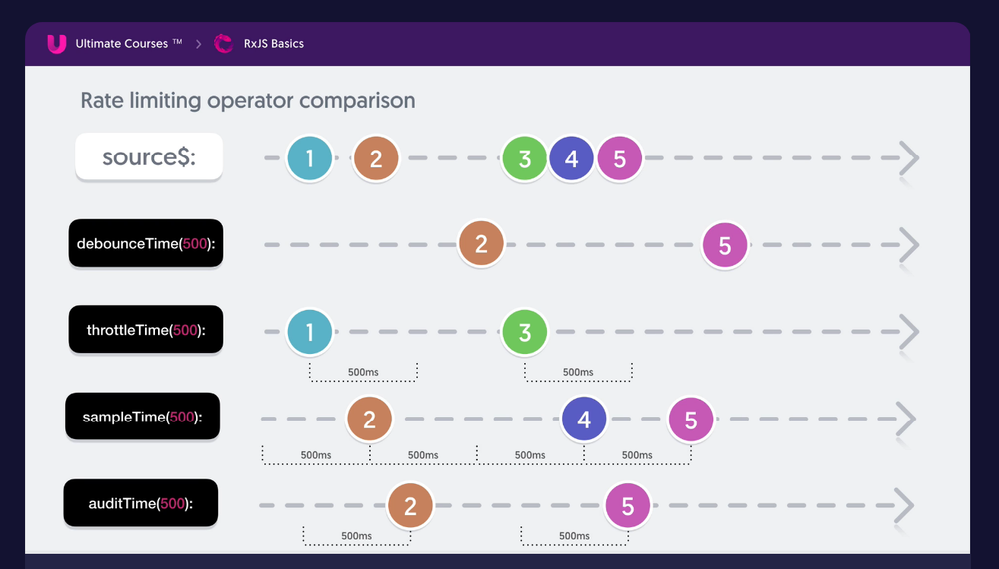
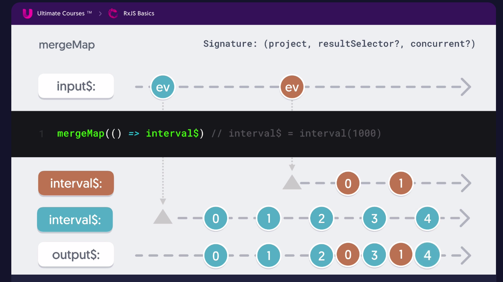
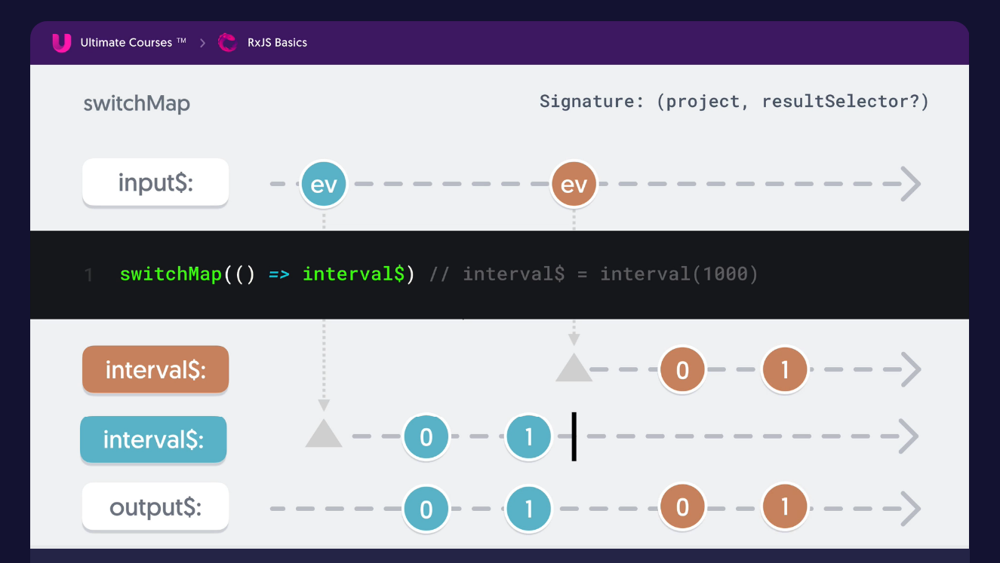
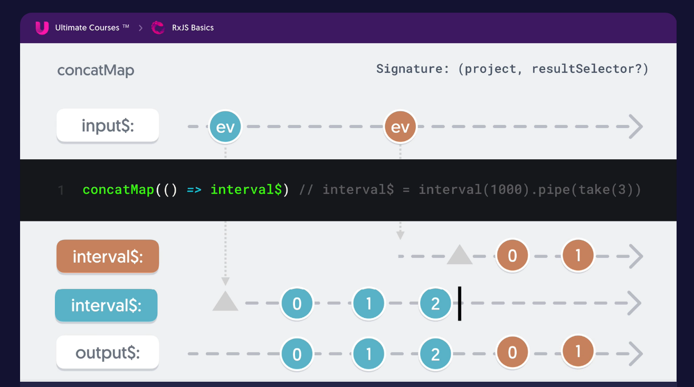
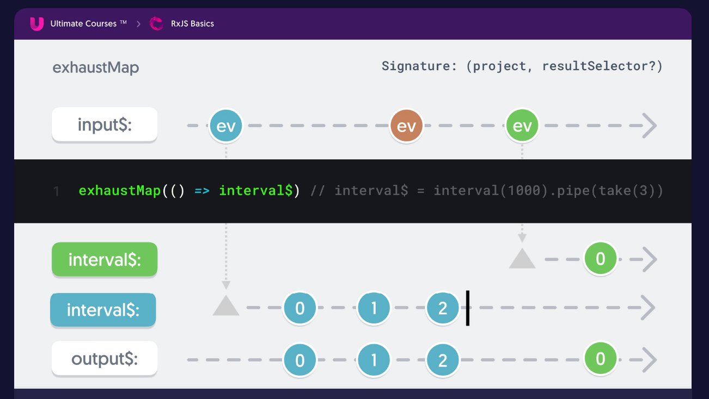
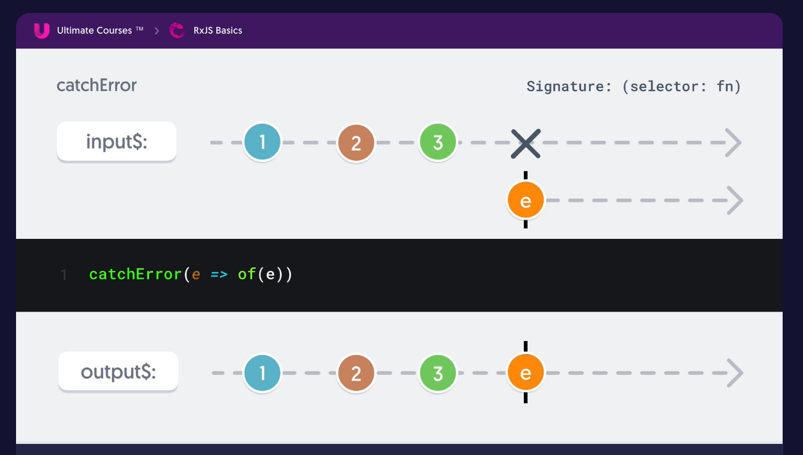
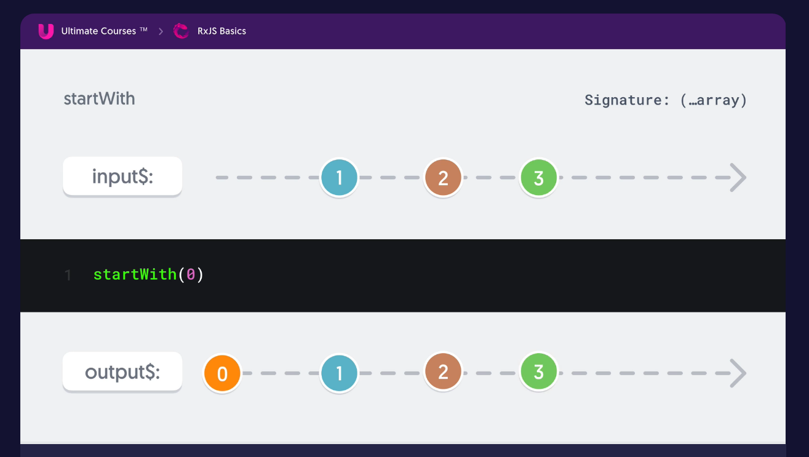
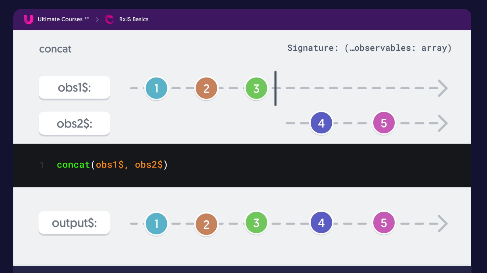
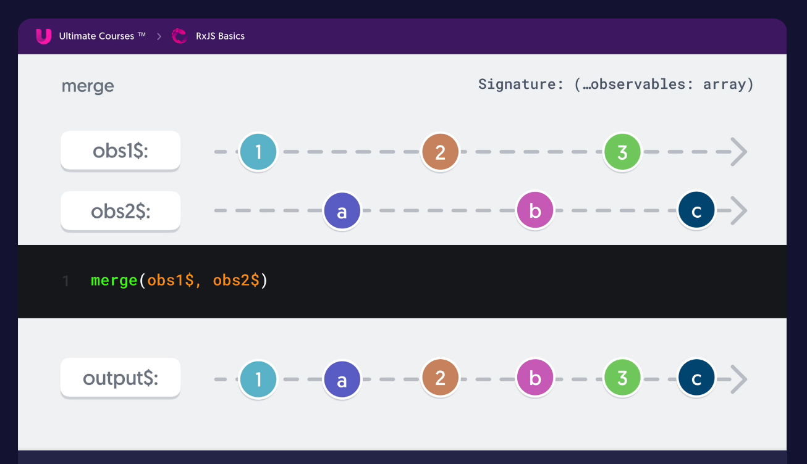
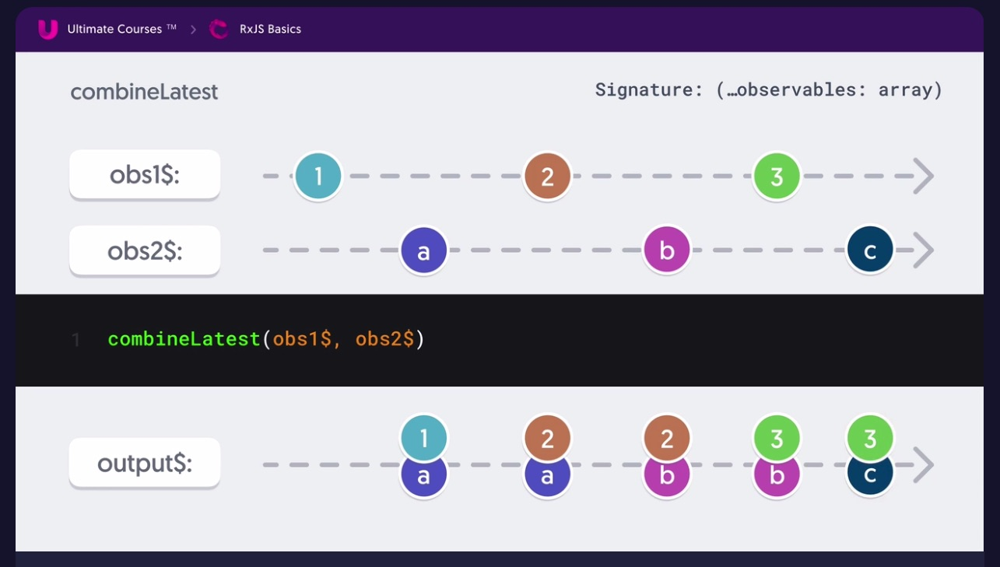

# RxJS Basic\(UltimateCourse\)

## Section 1. Getting started with RxJS

### Lesson 1. The missing introduction to RxJS

**ReactiveX is a combination of the best ideas from the Observer pattern, the Iterator pattern, and functional programming**

### Lesson 2. Configuring your project to use RxJS

```text
npm i rxjs
```

### Lesson 3. Create your first observable

\[[https://stackblitz.com/edit/create-your-first-observable](https://stackblitz.com/edit/create-your-first-observable)\]

`Note`: 

1. `Observer` is either a object with 3 methods : `next`, `error`, `complete`  or 3 callback functions
2. `Observable` is lazy,  they only emit value if there is a `subscriber` aka `Observer` subscribed to it

### Lesson 4. Understanding observers, partial observers, and subscribers

`Note`:

1. When not using a object, you can supply 3 function in order `next` , `error`, `complete` . If you don't want any of those 3, just use `null`
2.  The `Observer` doesn't need to have all 3 methods, but required at least 1

### Lesson 5. Deliver values asynchronously with observables

\[[https://stackblitz.com/edit/deliver-values-asynchronously-with-observables](https://stackblitz.com/edit/deliver-values-asynchronously-with-observables)\]

### Lesson 6. Manage observable subscriptions with unsubscribe

\[[https://stackblitz.com/edit/manage-observable-subscriptions-with-unsubscribe](https://stackblitz.com/edit/manage-observable-subscriptions-with-unsubscribe)\]

`Note`:

1.  When you subscribe to an `Observable` , a `Subscription` object is returned, and it has a `unsubscribe` method
2.  Calling unsubscribe will not fire your complete callback, but the returned function will be invoked cleaning up any resources that were created by the subscription

### Lesson 7. Introduction recap and what’s next

1.  `Observables` are pushed based
2. `Observables` are cold \(by default\) which means they only start emitting values when there is a `Subscriber`
3.  `Observables` can emit multiple values
4. `Observables` can deliver values both synchronously and asynchronously
5. `Observables` can be cancelled

## Section 2. Creation Operators

### Lesson 1. Introduction to creation operators

Create `Observable` from almost any source using creation operators such as `of`, `from`, `fromEvent`, `interval`

### Lesson 2. Create observables from DOM events using fromEvent

\[[https://stackblitz.com/edit/create-observables-from-dom-events-using-fromevent](https://stackblitz.com/edit/create-observables-from-dom-events-using-fromevent)\]

### Lesson 3. Create observables from static values using of

\[[https://stackblitz.com/edit/create-observables-from-static-values-using-of](https://stackblitz.com/edit/create-observables-from-static-values-using-of)\]

### Lesson 4. Turn arrays, iterators, and promises into observables using from

`Note`: `from` depends on the type of value, `from` accept `Observable`, `Promise`, `Array`, or `Iterable` \(like string\).

\[[https://stackblitz.com/edit/turn-arrays-iterators-and-promises-into-observables-using-from](https://stackblitz.com/edit/turn-arrays-iterators-and-promises-into-observables-using-from)\]

### Lesson 5. Emit items based on a duration with interval and timer

\[[https://stackblitz.com/edit/emit-items-based-on-a-duration-with-interval-and-timer](https://stackblitz.com/edit/emit-items-based-on-a-duration-with-interval-and-timer)\]

### Lesson 6. Creation operators recap and what’s next

`Note`: `Pipeable` Operators can:

1. Combine streams
2. Filter streams
3. Transform streams
4. + more

## Section 3. Getting Started with Operators

### Lesson 1. Introduction to operators

`Recap`:

1. `Operators` are the power behind RxJS, letting you more easily compose complex asynchronous code
2. `Operators` can be applied by including them into `pipe` method
3. `Operators` returns a new `Observable` without modifying the input `Observable`
4.  A core set of operators can solve the majority of use cases, while others can be picked up as the situation arise

### Lesson 2. Introduction to marble diagrams

`Note`:

1. Input diagrams
2. Operator
3. Output diagrams

We can even use text description of these diagrams to write unit test

### Lesson 3. Transform streams using map, pluck, and mapTo

\[[https://stackblitz.com/edit/transform-streams-using-map-pluck-and-mapto](https://stackblitz.com/edit/transform-streams-using-map-pluck-and-mapto)\]

`Note`:

1. `map` is used to extract 1 or more properties on an object
2. `pluck` is used to extract a property\(even nested property\) on an object
3. `mapTo` is use to emit a given constant value whenever the source `Observable` emits a value

### Lesson 4.  Ignore unneeded values with filter

\[[https://stackblitz.com/edit/ignore-unneeded-values-with-filter](https://stackblitz.com/edit/ignore-unneeded-values-with-filter)\]

### Lesson 5. Create a scroll progress bar with fromEvent and map

\[[https://stackblitz.com/edit/lab-1-create-a-scroll-progress-bar-with-fromevent-and-map](https://stackblitz.com/edit/lab-1-create-a-scroll-progress-bar-with-fromevent-and-map)\]

### Lesson 6. Accumulate data over time using reduce

\[[https://stackblitz.com/edit/accumulate-data-over-time-using-reduce](https://stackblitz.com/edit/accumulate-data-over-time-using-reduce)\]

`Note`:

1. `reduce` only emits one value, the final accumulated value
2. use `scan` if you want to emit each accumulated value

### Lesson 7. Manage state changes incrementally with scan

\[[https://stackblitz.com/edit/manage-state-changes-incrementally-with-scan](https://stackblitz.com/edit/manage-state-changes-incrementally-with-scan)\]

### Lesson 8. Create a countdown timer using interval, map, and scan

\[[https://stackblitz.com/edit/create-a-countdown-timer-using-fromevent-map-and-scan](https://stackblitz.com/edit/create-a-countdown-timer-using-fromevent-map-and-scan)\]

### Lesson 9. Debug your observable streams with tap

\[[https://stackblitz.com/edit/debug-your-observable-streams-with-tap](https://stackblitz.com/edit/debug-your-observable-streams-with-tap)\]

`Note`:

1. Avoid jamming side-effects into `tap` , side-effects should be handle inside `subscribe`
2.  Usually `tap` is use for debugging, console log value in the streams

## Section 4. Filtering Operators

### Lesson 1.  Introduction to filtering operators

`Recap`:

1. Ignores values based on some criteria

   1. filtering out special event
   2. removing duplicate emissions
   3. completing observable on conditions
   4. + more

2. Some operators to explore: `take`, `takeUntil`, `takeWhile`, `distinctUntilChanged`

### Lesson 2. Emit a set number of values from a stream with take

\[[https://stackblitz.com/edit/emit-a-set-number-of-values-from-a-stream-with-take](https://stackblitz.com/edit/emit-a-set-number-of-values-from-a-stream-with-take)\]

`Note`:

1. Use `take` when you want to only take a number of values from stream
2. If you want to only take the 1st value that match some condition, you can also use `first` compare to using `take(1)` combine with `filter`

### Lesson 3. Complete a stream when a condition is met with takeWhile

\[[https://stackblitz.com/edit/complete-a-stream-when-a-condition-is-met-with-takewhile](https://stackblitz.com/edit/complete-a-stream-when-a-condition-is-met-with-takewhile)\]

`Note`: `takeWhile` complete a stream while `filter` still let the stream run behind the scene

### Lesson 4. Complete a stream based on another stream using takeUntil

\[[https://stackblitz.com/edit/complete-a-stream-based-on-another-stream-using-takeuntil](https://stackblitz.com/edit/complete-a-stream-based-on-another-stream-using-takeuntil)\]

`Note`:

1. When you want to to complete a stream base on other stream we can use `takeUntil`
2. `takeUntil(notifier$)`

### Lesson 5. Ignore non unique values using distinctUntilChanged

\[[https://stackblitz.com/edit/ignore-non-unique-values-using-distinctuntilchanged](https://stackblitz.com/edit/ignore-non-unique-values-using-distinctuntilchanged)\]

`Note`:

1. `distinctUntilChanged` can take a compare function to decide which value is unique\(can use w `lodash` library\)
2. When to compare a property object in between emission, you can use `distinctUntilKeyChanged`

## Section 5. Rate Limiting Operators

### Lesson 1. Introduction to rate limiting operators

`Recap`:

1. `Time based` filtering operators
   1. emitting last value after a pause
   2. sampling stream on certain duration
   3. other time based conditions
2. Some operators to explore
   1. `debounceTime`, `throttleTime`, `sampleTime`, `auditTime`

### Lesson 2. Take the latest value after a pause debounceTime

\[[https://stackblitz.com/edit/take-the-latest-value-after-a-pause-debouncetime](https://stackblitz.com/edit/take-the-latest-value-after-a-pause-debouncetime)\]

`Note:`

1. Emits a value from the source Observable only after a particular time span has passed without another source emission.
2. Common use case: Use with input type
3. Commonly use with `distinctUntilChanged` to avoid sending the same value twice

### Lesson 3. Ignore values during windows using throttleTime

\[[https://stackblitz.com/edit/ignore-values-during-windows-using-throttletime](https://stackblitz.com/edit/ignore-values-during-windows-using-throttletime)\]

### Lesson 4. Sample a stream on a uniform duration using sampleTime

\[[https://stackblitz.com/edit/sample-a-stream-on-a-uniform-duration-using-sampletime](https://stackblitz.com/edit/sample-a-stream-on-a-uniform-duration-using-sampletime)\]

`Note`:

1.  `sampleTime` emits the most recently emitted value from the source Observable within periodic time intervals.

### Lesson 5. Audit a stream for a duration after an event occurs using auditTime

`Note`:

1. `auditTime` ignores source values for `duration` milliseconds, then emits the most recent value from the source Observable, then repeats this process.

`Recap`: Compare chart between `debounceTime`, `throttleTime`,  `sampleTime`, `auditTime`



## Section 6. Transformation Operators

### Lesson 1. Introduction to transformation operators

`Recap`:

1. Transform value as they flow through stream
2. Flattening operators
   1. What does `flattening` mean?
   2. Comparing `mergeMap`, `concatMap`, `switchMap`, `exhaustMap`
3.  Often used operator with transformation operators
   1. `catchError`, `finalize`, `delay`

### Lesson 2. What’s a flattening operator?

`Recap`: 

1. `Flattening operator` takes in an observable that emits another observable subscribing internally, emitting result to outer stream
2. Why use `Flattening operator` ? Because of the nature of Observable, lazy by default, that means we have to subscribe from the `inner observable` then subscribe again on the `outer observable` , to avoid that we can use `Flattening operator` to only subscribe once at the `outer observable`

### Lesson 3. Flatten inner observables as they occur with mergeMap

\[[https://stackblitz.com/edit/flatten-inner-observables-as-they-occur-with-mergemap](https://stackblitz.com/edit/flatten-inner-observables-as-they-occur-with-mergemap)\]

`Note`:

1. Map values to new observable on emission from source, subscribing to and emitting results from inner observables
2. By default, `mergeMap` does not limit the number of active inner observables, and if the inner observable is like `interval` then the outer observable will repeat itself, you can limit the number of active inner observables using 3rd parameter call `concurrent`
3. Useful for HTTP requests you don't want to cancel, like POST
4. Inner observable whose life time you want to manage using operator like `take`, `takeUntil`
5. Remember to cleanup inner observable or it will cause memory leak



### Lesson 4. Switch to a new observable on emissions using switchMap

\[[https://stackblitz.com/edit/switch-to-a-new-observable-on-emissions-using-switchmapp](https://stackblitz.com/edit/switch-to-a-new-observable-on-emissions-using-switchmapp)\]

`Note`:

1. `switchMap` switches to a new observable on emissions from source, cancelling any previous active inner observable
2. Safest default for flattening, hard to create leaks like `mergeMap`
3. Useful for HTTP request that can be cancelled \(GET\)
4. Great for reset, pause, resume functionality
5. Avoid `switchMap` when cancellation could have undesired effects, such as saves \(POST\)



### Lesson 5. Subscribe to observables in order with concatMap

\[[https://stackblitz.com/edit/subscribe-to-observables-in-order-with-concatmap](https://stackblitz.com/edit/subscribe-to-observables-in-order-with-concatmap)\]

`Note`:

1. Maintains one active inner subscription, activates next observable when previous completes
2. Use when order of execution is important and inner observables have finite lifespans
3. Be careful if you have long running inner observables, or subsequent mapped observables could backup or never execute



### Lesson 6. Ignore emissions when an inner observable is active with exhaustMap

`Note`:

1. Ignores emitted values when there is an active inner observable
2. Use when quick, subsequent emissions can be ignored, like a refresh button or login request
3. Avoid if cancellation is important, or ignoring emissions from the source would cause undesired effects



### Lesson 7. Catch errors on observables with catchError

\[[https://stackblitz.com/edit/catch-errors-on-observables-with-catcherror](https://stackblitz.com/edit/catch-errors-on-observables-with-catcherror)\]

`Note`:

1. `catchError` does complete your observable, so be careful where you want to use them



### Lesson 8. Create an HTTP polling solution

\[[https://stackblitz.com/edit/create-an-http-polling-solution](https://stackblitz.com/edit/create-an-http-polling-solution)\]

## Section 7. Combination Operators

### Lesson 1.  Introduction to combination operators

`Recap`:

1. Join multiple observables into single stream

   1. Combine multiple requests
   2. Perform calculations based on multiple stream inputs
   3. Tacking on values to beginning or end of stream
   4. `startWith`, `concat`, `merge`, `combineLatest`, `forkJoin`...

2. Sharing observable execution with the `share` operator

### Lesson 2. Append values to a stream using startWith and endWith

\[[https://stackblitz.com/edit/append-values-to-a-stream-using-startwith-and-endwith](https://stackblitz.com/edit/append-values-to-a-stream-using-startwith-and-endwith)\]



### Lesson 3. Queue observable execution using concat

\[[https://stackblitz.com/edit/queue-observable-execution-using-concat](https://stackblitz.com/edit/queue-observable-execution-using-concat)\]

`concat` concatenates multiple Observables together by sequentially emitting their values, one Observable after the other.

1. Use case: ordered HTTP request, animation, countdown UI



### Lesson 4. Combine multiple active observables using merge

\[[https://stackblitz.com/edit/combine-multiple-active-observables-using-merge](https://stackblitz.com/edit/combine-multiple-active-observables-using-merge)\]

`Note`: 

1. `merge` creates an output Observable which concurrently emits all values from every given input Observable.



### Lesson 5. Receive the latest values from multiple observables on emissions using combineLatest

\[[https://stackblitz.com/edit/receive-the-latest-values-from-multiple-observables-on-emissio](https://stackblitz.com/edit/receive-the-latest-values-from-multiple-observables-on-emissio)\]

`Note`:

1. Each time any stream provided to `combineLatest` emits a value, the latest value from all provided streams will be emitted as an array. Note that all provided streams must emit at least one value `beforecombineLatest` will emit any values.
2. When you want to augment one stream with information from a second stream on emitted values, `withLatestFrom` is a perfect choice.
3. `combineLatest` is great when an element depends on the combination of multiple streams to make some calculation or determination.



### Lesson 6. Receive the latest value from multiple observable on completion with forkJoin


